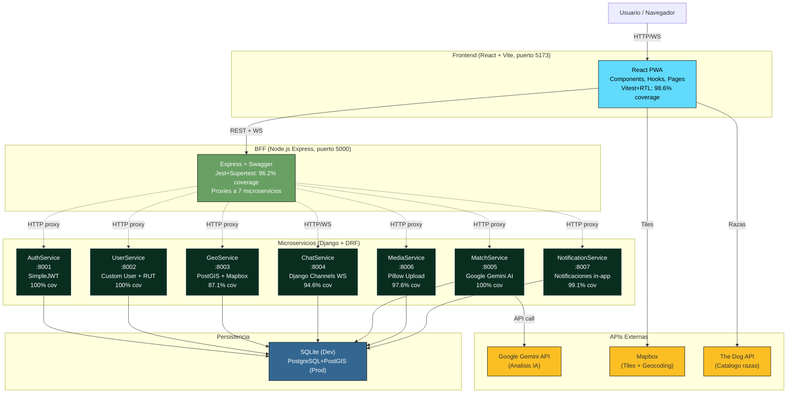

# Arquitectura — Sanos y Salvos (Parcial 3)

Plataforma fullstack basada en microservicios con un **BFF** (Backend-For-Frontend) que centraliza el acceso desde el cliente React a **7 microservicios Django** independientes.

## Diagrama (Mermaid)

> Si tu visor de Markdown no renderiza Mermaid, abre **`arquitectura.html`** (mismo diagrama, standalone con mermaid.js desde CDN) o el PNG **`arquitectura.png`** si fue generado.

## Capas

1. **Cliente** — Navegador web (HTTP/WebSocket).
2. **Frontend (React + Vite)** — SPA con hooks personalizados por servicio (`useAuth`, `useChat`, `useMediaUpload`, `useMatchAnalysis`, `useNotifications`, `useGeoService`). Empaquetado por Vite.
3. **BFF (Express)** — Backend-For-Frontend que actua como **API Gateway**: agrega autenticacion, simplifica el contrato hacia el cliente y proxea/transforma cada request hacia el microservicio correspondiente.
4. **Microservicios Django** — 7 servicios independientes, cada uno con su propia DB y dominio acotado.
5. **APIs externas** — Google Gemini (analisis de imagenes), Mapbox (mapas) y The Dog API (catalogo de razas).
6. **Persistencia** — SQLite en desarrollo, PostgreSQL + PostGIS en produccion (para GeoService).

## Patrones de diseno aplicados

### 1. API Gateway Pattern (BFF)
El BFF Express (`/PROYECTO-fullsatck-3-main/frontend_sanos_y_salvos-main/backend/`) actua como **unica puerta de entrada** desde el frontend. Beneficios:
- El cliente no conoce los puertos / URLs de los 7 microservicios.
- Centraliza la inyeccion de headers (`Authorization`, CORS).
- Permite cambiar la topologia interna sin tocar el cliente.

Implementacion: routers de Express por dominio (`routes/{auth,pets,clinics,match,media,notifications,chat}.js`) que delegan al microservicio correcto usando `axios` o `http-proxy`.

### 2. Repository Pattern (Django ORM)
Cada microservicio expone su persistencia a traves del **Django ORM**, que actua como **Repository**. La logica de acceso a datos esta encapsulada en `models.py` + `Manager`s personalizados. Ejemplos:
- `geo_app/models.py::Location` con metodos de busqueda por proximidad.
- `users/models.py::User` con validators chilenos.
- `notification_app/models.py::Notification` con scopes por usuario.

### 3. Circuit Breaker
Implementado en **GeoService** (`geo_app/circuit_breaker.py` + `service_clients.py`) para llamadas salientes a `UserService` y `PetService`. Cuando el upstream falla repetidamente, el circuito se abre y los siguientes requests fallan rapido (sin esperar timeout) durante un cooldown. Ventajas:
- Evita cascada de fallas entre microservicios.
- Mejora la resiliencia del sistema.
- Tested con `pytest` en `geo_app/tests/test_extra_coverage.py` (6 tests para UserServiceClient + 10 para PetServiceClient cubriendo OK, `CircuitBreakerException` y excepciones genericas).

### 4. Factory Method
Aplicado en **AuthService** para la creacion de tokens JWT (`rest_framework_simplejwt.tokens.RefreshToken.for_user()`), que abstrae la construccion del par access/refresh segun el usuario, sin que el caller conozca el algoritmo de firma ni la composicion del payload.

### 5. Microservices Architecture
- **DB-per-service**: cada microservicio tiene su propia SQLite/PostgreSQL.
- **Comunicacion HTTP REST** entre servicios (no foreign keys cross-DB).
- **Independencia de despliegue**: cada uno corre en su propio puerto y se puede actualizar sin tocar los demas.
- **Bounded contexts**: cada servicio modela un subdominio (auth, geo, chat, match, media, notifications, user).

## Comunicaciones cross-service
| Origen | Destino | Proposito | Mecanismo |
|---|---|---|---|
| Frontend | BFF | Todas las acciones | HTTP REST + WS (chat) |
| BFF | AuthService | Validar tokens, login | HTTP REST |
| BFF | UserService | CRUD usuarios | HTTP REST |
| BFF | GeoService | Reportes geolocalizados | HTTP REST (proxy axios) |
| BFF | ChatService | Sala / config WS | HTTP REST |
| Frontend | ChatService | Mensajeria en tiempo real | WebSocket directo |
| BFF | MatchService | Analisis IA | HTTP REST (http-proxy) |
| BFF | MediaService | Upload de imagenes | HTTP REST (http-proxy multipart) |
| BFF | NotificationService | Disparar y listar notifs | HTTP REST (axios) |
| GeoService | UserService/PetService | Enriquecer reportes | HTTP REST con Circuit Breaker |
| MatchService | Google Gemini | Analisis de imagen | HTTP REST (SDK oficial) |
| Frontend | Mapbox | Tiles del mapa | HTTP REST |

## Resiliencia y observabilidad
- **Circuit Breaker** en GeoService (descrito arriba).
- **Health endpoints** en cada microservicio (`/health`, `/ready`, `/alive`).
- **Healthcheck del BFF**: `GET /api/health`.
- **Logging estructurado** con niveles `INFO/WARN/ERROR`.

## Roadmap de evolucion (no implementado en este parcial)
- Reemplazar SQLite por PostgreSQL en todos los servicios.
- Activar PostGIS para GeoService (queries `ST_DWithin` reemplazando haversine en Python).
- Mover comunicacion async a Kafka / RabbitMQ.
- Containerizar todo con Docker + docker-compose.
