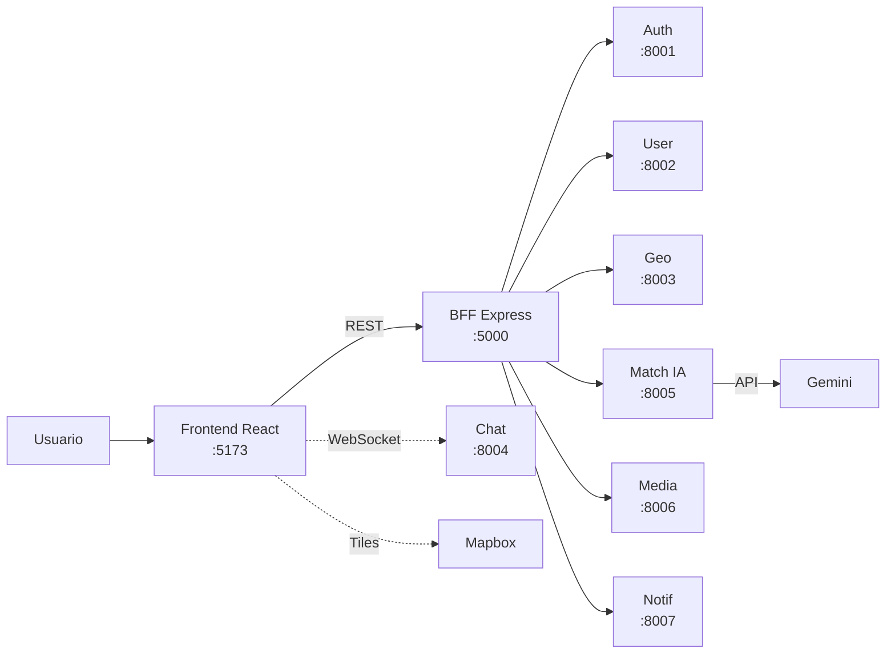

# Sanos y Salvos — Como funciona

Documento de vision ejecutivo-tecnica. Lectura ~10 minutos.
Para el detalle profundo ver `01-arquitectura/`, `02-persistencia/`, `03-pruebas/`.

---

## Que es

Plataforma web para reportar y buscar mascotas perdidas o encontradas en Chile.
Cada reporte queda georreferenciado en un mapa y la comunidad recibe alertas
cuando hay una posible coincidencia. Construida sobre 7 microservicios Django,
un BFF en Node.js y un frontend React.

---

## A quien sirve

| Usuario | Para que |
|---|---|
| Dueno que perdio su mascota | Crear reporte con foto y ubicacion, recibir avisos de coincidencias |
| Persona que encontro una mascota | Reportar avistamiento y contactar al dueno |
| Comunidad de un barrio | Chatear por zonas, ver el mapa, coordinar busquedas |
| Administrador | Moderar reportes y usuarios desde Django Admin |

Caso real: vecino encuentra un perro suelto en Providencia, sube la foto desde
el celular, la IA describe automaticamente raza y color, el reporte aparece en
el mapa, y al dueno (que ya tenia su reporte "perdido" abierto en la misma
zona) le llega una notificacion in-app en menos de un minuto.

---

## Arquitectura en una mirada

El frontend solo conoce una URL: la del BFF. El BFF reparte el trabajo a los
microservicios correspondientes. El unico caso especial es el chat, que abre
WebSocket directo contra Chat Service para latencia minima.

---

## Piezas y responsabilidades

| Pieza | Stack | Puerto | Responsabilidad |
|---|---|---:|---|
| Frontend | React 19 + Vite 5 | 5173 | UI, formularios, mapa, hooks por dominio |
| BFF | Node.js 20 + Express | 5000 | API unica, proxy, orquestacion, Swagger |
| AuthService | Django + SimpleJWT | 8001 | Emision y refresh de tokens JWT |
| UserService | Django + DRF | 8002 | CRUD de usuarios, validators chilenos (RUT, telefono) |
| GeoService | Django + Haversine | 8003 | Reportes geolocalizados, busqueda por radio |
| ChatService | Django Channels + Daphne | 8004 | Mensajeria tiempo real via WebSocket |
| MatchService | Django + google-genai | 8005 | Analisis IA de fotos de mascotas (Gemini) |
| MediaService | Django + Pillow | 8006 | Upload y servido de imagenes |
| NotificationService | Django + DRF | 8007 | Notificaciones in-app y trigger desde otros servicios |

---

## Por que un BFF (decision clave)

El frontend nunca habla directo con los 7 microservicios. Habla solo con el
BFF en `:5000`. Esto da:

- **Simplicidad**: una sola base URL en el cliente, no 7.
- **Centralizacion**: auth, CORS, logging y manejo de errores en un solo lugar.
- **Flexibilidad**: se puede dividir o renombrar un microservicio sin tocar la UI.
- **Patron estandar**: API Gateway aplicado a un cliente especifico (BFF).

Excepcion deliberada: el chat WebSocket conecta directo a ChatService para
evitar el costo de proxy bidireccional en tiempo real.

---

## Flujos end-to-end

### Flujo 1 — Reportar mascota perdida con foto

1. Usuario llena formulario en el Frontend (titulo, tipo, animal, ubicacion).
2. Frontend envia la foto al **BFF** → **MediaService (:8006)** → guarda y devuelve `imagen_url`.
3. Frontend envia la `imagen_url` al **BFF** → **MatchService (:8005)** → Gemini describe la mascota automaticamente.
4. Frontend arma el reporte completo (texto + URL imagen + descripcion IA) y lo envia al **BFF** → **GeoService (:8003)**.
5. GeoService guarda el reporte con coordenadas + URL de imagen.
6. El reporte aparece en el mapa de todos los usuarios al refrescar.

Si Gemini no esta disponible, el paso 3 devuelve un mensaje legible y el flujo
continua sin bloquearse (modo degradado).

### Flujo 2 — Recibir notificacion de posible coincidencia

1. Algun servicio (Match, Geo o un job futuro) detecta coincidencia por raza, zona y fecha.
2. Dispara `POST /api/notifications/trigger-match` al **BFF**.
3. **BFF** → **NotificationService (:8007)** crea el registro en DB.
4. **Frontend** hace polling cada 30s al endpoint de notificaciones del usuario.
5. La campanita del Header muestra badge rojo con el conteo no leido.
6. El usuario hace click, ve el detalle, y marca como leida (decrementa el badge).

### Flujo 3 — Chat en tiempo real

1. Usuario entra a `/chat` y elige una sala (ej: "perros-perdidos-providencia").
2. **Frontend** abre WebSocket a `ws://localhost:8004/ws/chat/<sala>/`.
3. **ChatService** acepta la conexion, suma al cliente al grupo de la sala.
4. Al recibir un mensaje: persiste en DB y hace **broadcast** a todos los conectados a esa sala.
5. Otros clientes reciben el mensaje al instante y lo renderizan como burbuja.

### Flujo 4 — Buscar mascotas cerca de mi ubicacion

1. **Frontend** obtiene coordenadas del navegador (o del centro del mapa).
2. **Frontend** → **BFF** → **GeoService**: `POST /buscar_cercanos {lat, lng, radio_km}`.
3. **GeoService** filtra reportes con formula Haversine (en SQLite dev) o `ST_DWithin` (PostGIS prod).
4. Devuelve lista ordenada por cercania con `distancia_km` calculada.
5. **Frontend** renderiza markers en el mapa Mapbox con popups por reporte.

---

## Persistencia

- **Database-per-Service**: cada microservicio tiene su propia DB independiente.
- **Dev**: SQLite zero-config. **Prod planificada**: PostgreSQL + PostGIS para Geo.
- **Sin foreign keys cross-servicio**: los IDs viven como referencias sueltas y
  se resuelven via HTTP cuando se necesita enriquecer datos.

Ver detalle en `02-persistencia/persistencia.md`.

---

## Patrones aplicados

| Patron | Donde se aplica |
|---|---|
| API Gateway | BFF Express concentra el acceso |
| Repository | Django ORM en cada microservicio |
| Circuit Breaker | GeoService → clientes a User/Pet Service |
| Factory Method | Generacion de tokens JWT en AuthService |
| Database-per-Service | 7 DBs independientes, una por microservicio |

---

## Metricas del sistema

- **9 componentes** corriendo en paralelo (7 microservicios + BFF + Frontend).
- **337 pruebas unitarias**, 0 fallos, cobertura promedio **>94%**.
- **~25 endpoints REST** expuestos en total (entre BFF y microservicios).
- **1 canal WebSocket** para mensajeria real-time.
- **3 APIs externas**: Gemini, Mapbox, The Dog API.

Ver desglose por servicio en `03-pruebas/informe-pruebas.md`.

---

## Decisiones clave (para defensa)

| Decision | Por que |
|---|---|
| Microservicios vs monolito | Bounded contexts claros, despliegue y escalado independientes |
| Django vs FastAPI | ORM maduro, admin gratis, DRF estandar academico y profesional |
| BFF en Node vs Python | Express es agil para orquestacion, ecosistema npm para http-proxy |
| WebSocket directo (Chat) | Evita overhead de proxy bidireccional; menor latencia |
| In-app vs email (notifs) | UX moderna, sin depender de SMTP, sin spam |
| JWT vs sesion server-side | Stateless, escala horizontal sin sticky sessions |
| SQLite en dev | Zero-config, defensa rapida sin instalar Postgres |

---

## Limitaciones conocidas (honestidad tecnica)

- **Chat sin auth en el WS**: cualquier usuario autenticado puede unirse a cualquier sala. Faltaria `AuthMiddlewareStack` de Channels.
- **NotificationListView no valida ownership**: la query por `user_id` es publica, deberia exigir token coincidente.
- **Channel layer in-memory**: el broadcast del chat solo funciona en una instancia. Multi-instancia requiere Redis.
- **AuthService duplica funcionalidad** de UserService respecto a JWT. Candidato a fusionar.
- **GEMINI_API_KEY** estuvo hardcoded en commits previos; ya esta en `.env` (gitignored) pero hay que rotarla antes de publicar el repo.
- **MatchService no calcula coincidencias automaticas todavia**: el endpoint de trigger existe, pero la deteccion (cron / comparacion vectorial) queda como roadmap.

---

## Que NO esta en alcance del Parcial 3

- Contenedores Docker / docker-compose.
- CI/CD en GitHub Actions.
- Tests E2E con Playwright (solo unitarios e integracion).
- Despliegue en cloud.
- App movil nativa.
- Pagos / monetizacion.

Roadmap completo en `01-arquitectura/arquitectura.md`.
